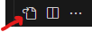

- [Overview](#overview)
- [Installation](#Installation)
    - [Install Dependencies](#install-dependencies)
	- [Godot](#godot)
	- [VS Code](#vs-code)
	    - [Optional Settings](#optional-settings)
		- [Running in VS Code](#running-in-vs-code)

# Overview
A simple tower defense game as a means of learning more about Godot, C#, and game development.

# Installation
## Install Dependencies
This project uses the following
- [Godot .Net 4.4](https://godotengine.org/releases/4.4/)
- [dotnet 8.0.406](https://dotnet.microsoft.com/en-us/download/dotnet/8.0).  [This link](https://dotnet.microsoft.com/en-us/download/dotnet/thank-you/sdk-8.0.406-windows-x64-installer) will auto-install the 8.0.406 executable if you have trouble finding it in the first link.
- [VS Code](https://code.visualstudio.com/), download the following extensions once installed:
	- .Net Install Tool
	- C# Dev Kit
	- C# Tools for Godot

## Godot
Godot will install as a zip.  Extract the zip to your desired location.  Optionally, once extracted, rename `Godot_v4.4-stable_mono_win64.exe` to `godot.exe`, this makes it easier to swap versions if needed.

You will have to import and open this repo within the godot editor at least once in order to run from VS Code.

## VS Code
#### Optional Settings
Below are some quality of life settings for VS code. Specifically integrated Git Bash, rulers, tab settings, auto saving, and trailing whitespace trimming. Navigate to File > Preferences > Settings and click this icon in the top right:



Paste the following json and save in order to apply these settings.
```json
{
    "window.menuBarVisibility": "visible",
    "terminal.integrated.defaultProfile.windows": "Git Bash",
    "terminal.integrated.enableMultiLinePasteWarning": false,
    "git.ignoreLegacyWarning": true,
    "workbench.tree.indent": 16,
    "debug.console.wordWrap": false,

    "[Log]": {
        "editor.wordWrap": "off"
    },

    "editor.foldingStrategy": "indentation",
    "editor.tabSize": 4,
    "editor.insertSpaces": true,
    "editor.rulers": [
        100,
        120
    ],

    "files.trimTrailingWhitespace": true,
    "files.trimFinalNewlines": true,
    "files.insertFinalNewline": true,
    "files.autoSave": "afterDelay",
    "files.autoSaveDelay": 1000
}
```

#### Running in VS Code
Open this repo within VS Code and Edit [launch.json](.vscode/launch.json) in the .vscode folder. This will allow you to run from VS code rather than running from the Godot editor.
```json
{
	"version": "0.2.0",
	"configurations": [
		{
			"name": "Run Godot",
			"type": "coreclr",
			"request": "launch",
			"preLaunchTask": "build",
			"program": "C:/YOUR/PATH/TO/godot.exe",
			"cwd": "${workspaceFolder}",
			"console": "internalConsole",
			"stopAtEntry": false,
			"args": ["--path", "${workspaceRoot}"]
		}
	]
}
```

After this file is edited, simply navigate to `Run and Debug`, choose `Run Godot` from the drop down, and press play.


