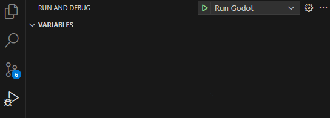

# Overview
A simple tower Defense game to learn more about Godot, C#, and game development.

# How to install
This project uses the following
- [Godot .Net 4.4](https://godotengine.org/releases/4.4/)
- [dotnet 8.0.406](https://dotnet.microsoft.com/en-us/download/dotnet/8.0)
- [VS Code](https://code.visualstudio.com/) along with the following extensions
	- .Net Install Tool
	- C#
	- C# Dev Kit
	- C# Tools for Godot

I have included my .vscode folder for easy installation.  You would just need to change the `program` arg in [launch.json](.vscode/launch.json)
```json
{
	"version": "0.2.0",
	"configurations": [
		{
			"name": "Run Godot",
			"type": "coreclr",
			"request": "launch",
			"preLaunchTask": "build",
			"program": "C:/YOUR/PATH/TO/godot.exe",
			"cwd": "${workspaceFolder}",
			"console": "internalConsole",
			"stopAtEntry": false,
			"args": ["--path", "${workspaceRoot}"]
		}
	]
}
```

# How to Run
Once VS Code is open, simply navigate to `Run and Debug`, choose `Run Godot` from the drop down, and press play.


